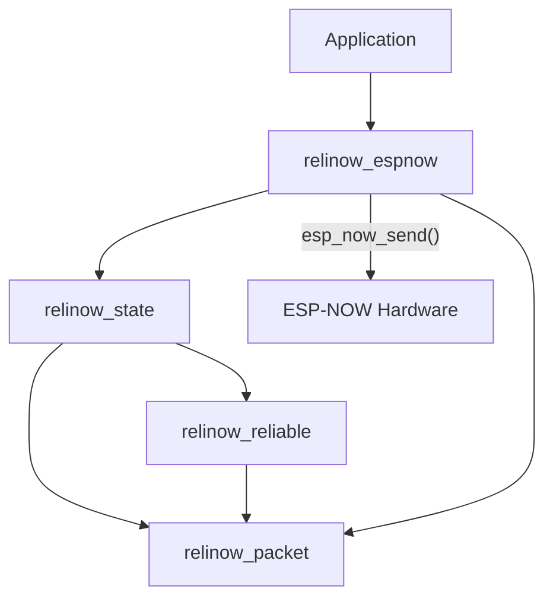
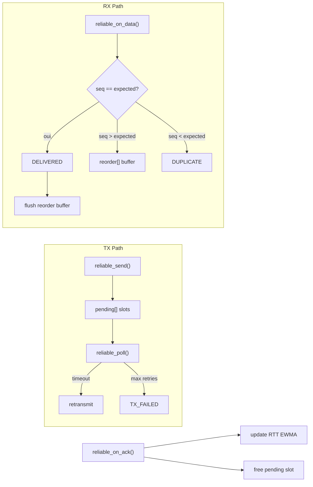
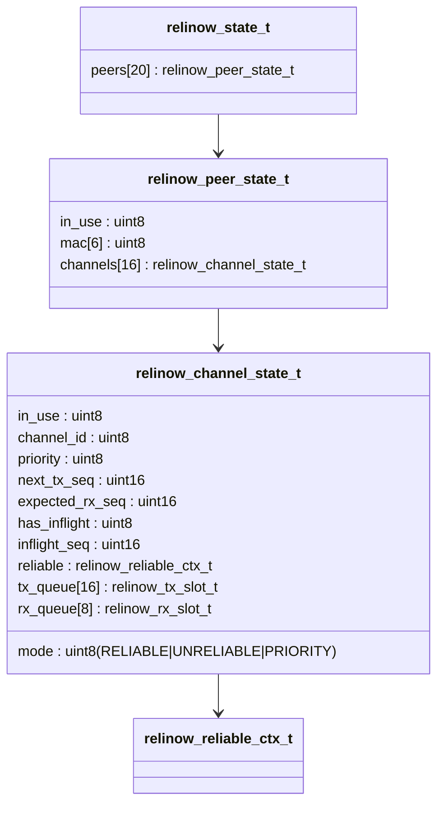
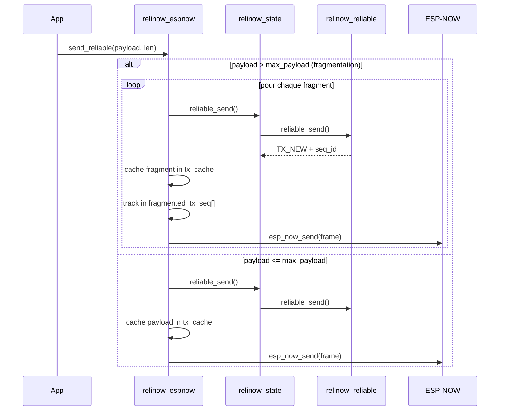
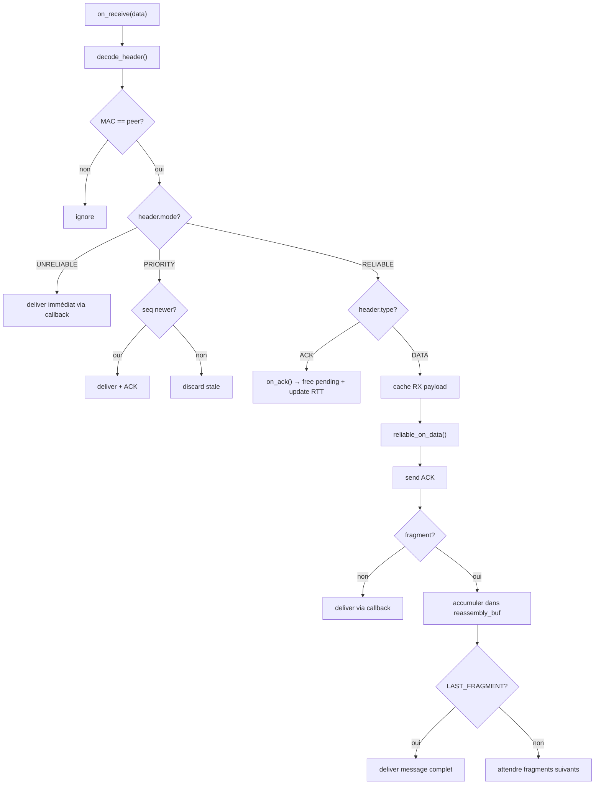

# Analyse du Projet ReliNow

## Vue d'ensemble

**ReliNow** est un protocole de transport léger construit au-dessus d'[ESP-NOW](https://docs.espressif.com/projects/esp-idf/en/stable/esp32/api-reference/network/esp_now.html) (la couche radio peer-to-peer d'Espressif). Il comble le manque de fiabilité d'ESP-NOW en ajoutant des mécanismes de type TCP (ACK, retransmission, ordering) tout en restant adapté aux contraintes embarquées (zéro allocation dynamique, header compact de 9 octets).

**Langage** : C pur (C99)  
**Cible** : ESP32 (WROOM-32, C3, S3) via ESP-IDF v6.0  
**Licence** : MIT  
**Statut** : Work in progress — le mode RELIABLE et la fragmentation sont implémentés, les modes PRIORITY et UNRELIABLE sont fonctionnels côté state/espnow.

---

## Structure du projet

```
relinow/
├── core/                    ← Bibliothèque C (le cœur du protocole)
│   ├── CMakeLists.txt       ← Composant ESP-IDF
│   ├── include/             ← 4 headers publics
│   └── src/                 ← 4 fichiers source (~1685 LOC total)
├── examples/
│   ├── esp32_a/             ← Firmware board A (ESP-IDF)
│   └── esp32_b/             ← Firmware board B (ESP-IDF)
├── tests/
│   ├── CMakeLists.txt       ← Tests unitaires sur host (CMake + CTest)
│   ├── fixtures/            ← Vecteurs de test générés
│   └── src/                 ← Sources de tests
├── tools/
│   ├── build_fixtures.py    ← Générateur de fixtures depuis YAML
│   └── requirements.txt
├── build/                   ← Artefacts de build (captures de test)
├── PROTOCOL.md              ← Spécification complète du protocole
├── TEST_MATRIX.yaml         ← Matrice de cas de test
├── TEST_VECTORS.yaml        ← Vecteurs de test binaires
└── eim_config.toml           ← Config ESP-IDF Installer (ESP-IDF v6.0)
```

---

## Analyse détaillée du dossier `core/`

Le core contient **4 modules** organisés en couches, de la plus basse (packet) à la plus haute (espnow) :



---

### 1. `relinow_packet` — Sérialisation du protocole

| Fichier | LOC | Rôle |
|---------|-----|------|
| [relinow_packet.h](file:///c:/Users/jalal/Desktop/Relinow/core/include/relinow_packet.h) | 67 | Constantes, enum d'erreurs, struct `relinow_header_t` |
| [relinow_packet.c](file:///c:/Users/jalal/Desktop/Relinow/core/src/relinow_packet.c) | 122 | Encode/decode/validate header, arithmétique séquentielle |

#### Ce que fait ce module

C'est la **couche la plus basse** : elle gère la sérialisation binaire du header de 9 octets en big-endian, conformément à la spec du protocole.

#### Fonctions clés

| Fonction | Description |
|----------|-------------|
| `relinow_encode_header()` | Struct → 9 octets wire format (big-endian) |
| `relinow_decode_header()` | 9 octets wire → struct, avec validation croisée taille frame vs payload_len |
| `relinow_validate_header()` | Validation complète : version, mode, type, flags, contraintes croisées |
| `relinow_is_seq_newer()` | Comparaison de séquences avec wraparound (RFC 1982, cast `int16_t`) |
| `relinow_seq_next()` | Incrément de séquence avec wraparound naturel `uint16_t` |

#### Qualité

- ✅ Validation rigoureuse et exhaustive (heartbeat channel, fragment flags, unreliable ack_id, etc.)
- ✅ Code défensif (null checks systématiques)
- ✅ Séparation propre encode/decode/validate
- ✅ Conformité totale à `PROTOCOL.md`

---

### 2. `relinow_reliable` — Moteur de fiabilité

| Fichier | LOC | Rôle |
|---------|-----|------|
| [relinow_reliable.h](file:///c:/Users/jalal/Desktop/Relinow/core/include/relinow_reliable.h) | 97 | Types : config, contexte, pending slots, reorder buffer |
| [relinow_reliable.c](file:///c:/Users/jalal/Desktop/Relinow/core/src/relinow_reliable.c) | 289 | Logique TX (send, poll, retransmit) et RX (ordering, reorder, deliver) |

#### Ce que fait ce module

C'est le **cœur algorithmique** du mode RELIABLE. Il gère :
- **TX** : file d'attente de paquets en vol (`pending[]`), timers de retransmission, backoff adaptatif
- **RX** : fenêtre de réception ordonnée, buffer de réordonnancement (`reorder[]`), détection de doublons
- **RTT** : estimation adaptative par EWMA en arithmétique virgule fixe Q8 (α = 32/256 ≈ 0.125)

#### Architecture interne



#### Fonctions clés

| Fonction | Description |
|----------|-------------|
| `relinow_reliable_send()` | Alloue un slot pending, assigne seq_id, démarre le timer |
| `relinow_reliable_on_ack()` | Libère le slot, met à jour le RTT via EWMA Q8 |
| `relinow_reliable_poll()` | Parcourt les pending, détecte les timeouts → RETRANSMIT ou FAILED |
| `relinow_reliable_on_data()` | Logique RX : deliver in-order, buffer out-of-order, flush continu |

#### Mécanisme de timeout (backoff)

```
retry 0 : rtt × 1.5
retry 1 : rtt × 2.0
retry 2 : rtt × 3.0
```

Implémenté en arithmétique entière (`uint32_t` intermédiaire, clamped à `[1, 65535]`).

#### Qualité

- ✅ Algorithme RTT EWMA identique à TCP (RFC 6298), implémenté proprement en virgule fixe
- ✅ Buffer de réordonnancement avec flush en cascade (délivre tout ce qui devient continu)
- ✅ Zero-alloc : tout est sur le stack/struct, pas de `malloc`
- ✅ Gestion correcte du premier paquet reçu (`has_rx_window`)

---

### 3. `relinow_state` — Gestionnaire d'état global

| Fichier | LOC | Rôle |
|---------|-----|------|
| [relinow_state.h](file:///c:/Users/jalal/Desktop/Relinow/core/include/relinow_state.h) | 211 | Toutes les structures d'état : peers, channels, queues TX/RX |
| [relinow_state.c](file:///c:/Users/jalal/Desktop/Relinow/core/src/relinow_state.c) | 629 | API complète : gestion peers, channels, delegation vers reliable/unreliable/priority |

#### Ce que fait ce module

C'est le **chef d'orchestre**. Il maintient l'état global du protocole :
- Table de **20 peers** max (identifiés par adresse MAC)
- **16 channels** par peer, chacun avec son propre mode, séquences, et queues
- Délègue les opérations au module `reliable` pour le mode RELIABLE
- Implémente directement les logiques UNRELIABLE et PRIORITY

#### Modèle de données



#### Fonctions clés par catégorie

**Gestion des peers :**
| Fonction | Description |
|----------|-------------|
| `relinow_state_add_peer()` | Ajoute un peer par MAC (idempotent : retourne l'existant si déjà présent) |
| `relinow_state_find_peer()` | Trouve un peer par MAC → retourne son index |

**Gestion des channels :**
| Fonction | Description |
|----------|-------------|
| `relinow_state_open_channel()` | Ouvre un canal avec mode immutable + priorité modifiable |
| `relinow_state_get_channel_mode()` | Consulte le mode d'un canal |
| `relinow_state_next_sequence()` | Génère le prochain seq_id pour un canal |

**Mode RELIABLE (délégation) :**
| Fonction | Description |
|----------|-------------|
| `relinow_state_reliable_send()` | Appelle `reliable_send()` + enqueue TX + mark inflight |
| `relinow_state_reliable_on_ack()` | Appelle `reliable_on_ack()` + clear inflight + dequeue TX |
| `relinow_state_reliable_poll()` | Appelle `reliable_poll()` + update inflight state |
| `relinow_state_reliable_on_data()` | Appelle `reliable_on_data()` + enqueue RX les paquets délivrés |

**Mode UNRELIABLE :**
| Fonction | Description |
|----------|-------------|
| `relinow_state_unreliable_send()` | Incrément seq, retourne → fire and forget |

**Mode PRIORITY (newest-wins) :**
| Fonction | Description |
|----------|-------------|
| `relinow_state_priority_send()` | Remplace l'ancien inflight si existant, retourne info de remplacement |
| `relinow_state_priority_on_data()` | N'accepte que les seq plus récents (`is_seq_newer`) |

#### Qualité

- ✅ Séparation claire : state délègue la logique mode-spécifique
- ✅ Mode conflict detection sur `open_channel` (même ID, mode différent → `ERR_CONFLICT`)
- ✅ Channel heartbeat protégé (0xFF interdit à l'ouverture)
- ✅ Toutes les fonctions valident les arguments et retournent des erreurs typées

#### Empreinte mémoire estimée

```
sizeof(relinow_state_t) ≈ 20 peers × (7 + 16 channels × sizeof(channel_state))
sizeof(channel_state) ≈ ~1.1 KB (reliable ctx + tx_queue + rx_queue)
Total ≈ ~350 KB pour max config (20 peers × 16 channels)
```

> [!NOTE]
> L'empreinte réelle dépend de la config compilée. En pratique, on a rarement 20 peers × 16 channels. La fonction `relinow_state_get_limits()` expose ces valeurs pour inspection runtime.

---

### 4. `relinow_espnow` — Adaptateur transport ESP-NOW

| Fichier | LOC | Rôle |
|---------|-----|------|
| [relinow_espnow.h](file:///c:/Users/jalal/Desktop/Relinow/core/include/relinow_espnow.h) | 134 | Configuration, caches TX/RX, struct node, API publique |
| [relinow_espnow.c](file:///c:/Users/jalal/Desktop/Relinow/core/src/relinow_espnow.c) | 644 | Implémentation complète : envoi 3 modes, réception, poll, fragmentation/réassemblage |

#### Ce que fait ce module

C'est la **couche la plus haute** du core — le lien entre le protocole ReliNow et l'API hardware ESP-NOW. Il :
- Gère le cycle de vie complet : init → send → receive → poll
- Maintient des **caches de payload** (TX et RX) pour les retransmissions et le réassemblage
- Implémente la **fragmentation/réassemblage** pour le mode RELIABLE
- Route les paquets reçus par mode (UNRELIABLE → direct, PRIORITY → newest-wins, RELIABLE → ordering + reassembly)

#### Flux d'envoi RELIABLE



#### Flux de réception



#### Callbacks exposés à l'application

| Callback | Signature | Quand |
|----------|-----------|-------|
| `on_message` | `(mac, channel, seq, payload, len, ctx)` | Paquet ou message fragmenté délivré |
| `on_tx_event` | `(event, seq_id, ctx)` | TX_NEW, TX_RETRANSMIT, ou TX_FAILED |

#### Qualité

- ✅ Fragmentation + réassemblage complets et fonctionnels
- ✅ Support des 3 modes dans la même boucle de réception
- ✅ Vérification pré-envoi des ressources disponibles (pending slots + tx_cache)

---

## Résumé des métriques

| Module | Header (LOC) | Source (LOC) | Octets | Complexité |
|--------|-------------|-------------|--------|------------|
| `relinow_packet` | 67 | 122 | 5.8 KB | Faible — sérialisation pure |
| `relinow_reliable` | 97 | 289 | 11.2 KB | Moyenne — algorithme RTT + reorder |
| `relinow_state` | 211 | 629 | 23.4 KB | Moyenne — orchestration multi-mode |
| `relinow_espnow` | 134 | 644 | 24.2 KB | Élevée — integration + fragmentation |
| **Total** | **509** | **1684** | **64.6 KB** | |

---

## 🐛 Bug identifié

> [!WARNING]
> **Typo dans `relinow_espnow.c` ligne 188** — `ESP_ERR_INVALIcD_ARG` au lieu de `ESP_ERR_INVALID_ARG`
> 
> ```c
> // Ligne 188 - relinow_espnow.c
> return ESP_ERR_INVALIcD_ARG;  // ← typo : 'c' en trop
> ```
> Ce code ne compilera pas si ce chemin d'erreur est atteint avec les headers ESP-IDF standards.

---

## Roadmap — État d'avancement

| Fonctionnalité | Statut | Commentaire |
|----------------|--------|-------------|
| Spécification protocole | ✅ Done | `PROTOCOL.md` complet et détaillé |
| Sérialisation paquet | ✅ Done | Encode/decode/validate robustes |
| Mode RELIABLE (DATA+ACK+retransmit+ordering) | ✅ Done | Avec RTT adaptatif et backoff |
| Fragmentation/réassemblage | ✅ Done | Implémenté dans `relinow_espnow` |
| Mode UNRELIABLE | ✅ Done | Send + receive fonctionnels (pas de loss stats encore) |
| Mode PRIORITY | ✅ Done | newest-wins implémenté côté state et espnow |
| Exemples hardware ESP32 A/B | ✅ Done | Testables sur vrais boards |
| Tests unitaires | ✅ Done | CMake + CTest + fixtures YAML |
| Channel multiplexing + scheduler | ❌ Manquant | Le scheduling par priorité n'est pas implémenté |
| Heartbeat (PING/PONG) | ❌ Manquant | Types définis mais aucune logique |
| Loss stats (UNRELIABLE) | ❌ Manquant | `relinow_get_stats()` non implémenté |
| Rust wrapper | ❌ Manquant | Prévu dans la roadmap |
| Benchmarks | ❌ Manquant | Prévu dans la roadmap |

---

## Évaluation globale de la qualité

### Points forts
- **Architecture en couches propre** : chaque module a une responsabilité unique et bien définie
- **Zero-alloc** : tout est statiquement alloué, parfait pour l'embarqué
- **Code défensif** : null checks systématiques, validation d'arguments, codes d'erreur typés
- **Conformité à la spec** : le code implémente fidèlement `PROTOCOL.md`
- **Testabilité** : les couches basses (packet, reliable, state) sont testables sur host sans hardware

### Axes d'amélioration
- Le fichier `relinow_espnow.c` (644 LOC) commence à être dense — candidat au split
- La struct `relinow_espnow_node_t` concentre beaucoup d'état (caches + reassembly) — considérer un refactor si des channels additionnels sont ajoutés
- Le module `relinow_espnow_on_send_status()` est un stub vide — le statut MAC layer n'est pas exploité
- Pas de `fragment_timeout` implémenté (prévu dans la spec à 5s)
