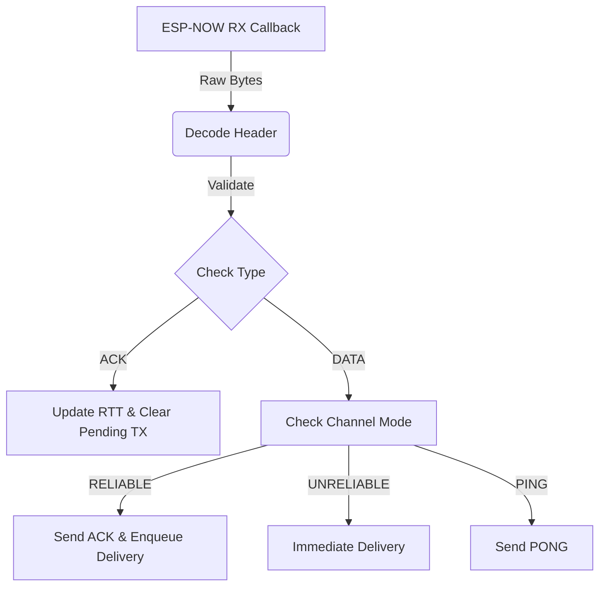

# Protocol Architecture

ReliNow operates on a custom 9-byte header attached to every payload.

## Packet Format

The binary format is optimized for alignment and zero-copy parsing.

| Offset | Size (Bytes) | Field Name | Description |
|--------|--------------|------------|-------------|
| 0      | 1            | `Version/Mode` | Upper 4 bits: Protocol Version (0x1). Lower 4 bits: Mode (1=Rel, 2=Unrel, 3=Prio) |
| 1      | 1            | `Type/Flags` | Upper 4 bits: Frame Type (Data, Ack, Nack, Ping, Pong). Lower 4 bits: Flags |
| 2      | 2            | `seq_id` | Sequence Identifier (Big Endian) |
| 4      | 2            | `ack_id` | Acknowledgment Identifier (Big Endian) |
| 6      | 1            | `channel_id` | Virtual Channel (0-15). 0xFF is reserved for Heartbeat |
| 7      | 2            | `payload_len`| Length of the user payload attached after the header |

## State Machine

The protocol state is managed by a master struct (`relinow_state_t` in C, `RelinowState` in Rust). 

Since embedded systems forbid dynamic allocation (`malloc`), the state memory is strictly bound at compile time through `#define` limits (or generic constants).

