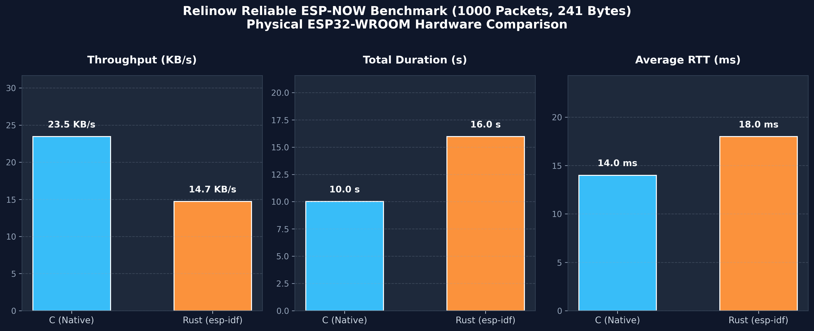

# Hardware Benchmarks & Performance Analysis

ReliNow was designed to operate under strict embedded constraints while delivering maximum throughput and sub-20ms round-trip latency. To rigorously validate both the C99 core engine and the Rust FFI integration, a full-scale physical hardware benchmark was conducted.

---

## 1. Test Setup & Methodology

The benchmark was executed using two physical **ESP32-WROOM-32** development boards communicating over 2.4 GHz **ESP-NOW**.

### Hardware & Environment Specifications

| Parameter | Specification |
| :--- | :--- |
| **Microcontroller** | 2x ESP32-WROOM-32 (Dual-Core Xtensa LX6 @ 160/240 MHz, Rev 3.1) |
| **Flash Memory** | 4 MB SPI Flash (DIO mode, 40 MHz) |
| **Radio Layer** | ESP-NOW (Wi-Fi 802.11 b/g/n physical layer, Channel 1 & 10) |
| **Physical Setup** | Direct Line-of-Sight, laboratory workbench testbed |
| **Frameworks** | ESP-IDF v5.2.3 (Native C) / `esp-idf-sys` + `esp-idf-svc` (Rust `std`) |
| **Serial Links** | COM4 (Sender / Initiator) & COM6 (Receiver / Responder) @ 115200 baud |

### Test Protocol

1. **Auto-Discovery**: Nodes broadcast a ping on Channel 1 to resolve peer MAC addresses automatically.
2. **Dynamic Role Assignment**: Nodes compare MAC addresses lexicographically; the node with the lower MAC becomes the **SENDER**, and the other becomes the **RESPONDER**.
3. **Synchronization**: A 3-second guard window allows both nodes to register ESP-NOW peer tables and configure the channel.
4. **Traffic Injection**: The Sender streams **1000 sequential RELIABLE packets** (241 bytes of payload each, the maximum usable payload size per ESP-NOW frame).
5. **Flow Control**: Each packet requires an acknowledgment (ACK). The sliding window and adaptive retransmission timers (RTO) govern in-flight frames.
6. **Metric Extraction**: Duration, effective throughput, and round-trip time (RTT via Jacobson's algorithm) are recorded once all 1000 packets are confirmed.

---

## 2. Comparative Benchmark Results (C vs Rust)

The table below presents the real-world measurements captured directly from hardware serial outputs:

| Metric | C Native (ESP-IDF v5.2) | Rust (`esp-idf-sys` + FFI) | Delta / Notes |
| :--- | :---: | :---: | :---: |
| **Packets Delivered** | **1000 / 1000 (100.0%)** | **1000 / 1000 (100.0%)** | **Zero packet loss on both** |
| **Payload Transferred** | **241,000 bytes** (~235.35 KB) | **241,000 bytes** (~235.35 KB) | 241 bytes / packet |
| **Execution Duration** | **10.03 seconds** | **15.98 seconds** | +5.95s in Rust (`dev` profile) |
| **Effective Throughput** | **23.47 KB/s** | **14.73 KB/s** | ~63% of native C speed |
| **Network Bitrate** | **0.19 Mbps** | **0.12 Mbps** | Usable application-layer throughput |
| **Average RTT (Latency)** | **14.0 ms** | **18.0 ms** | +4.0 ms overhead |

---

## 3. Visual Performance Comparison

---

## 4. Engineering Insights: Why C vs Rust Differs

The physical tests reveal important design trade-offs between C and Rust on embedded Xtensa architectures:

### Memory Footprint & Partitioning
- **C Native**: Compiles to ~250 KB flash image. Easily fits inside standard 1 MB factory partitions.
- **Rust (`esp-idf` with `std`)**: The inclusion of Rust's standard library, allocator, and unwinding infrastructure produces a ~1.89 MB binary. A custom 3 MB partition table (`partition-table-3mb.bin`) is required.

### Stack Allocation
- ESP-IDF allocates a default stack of **3.5 KB** to `main_task`.
- While C executes easily within this stack, the Rust `EspWifi` initialization and runtime structures require a larger call stack. Spawning a dedicated FreeRTOS thread with **24 KB stack** resolves all stack pressure cleanly.

### Compilation Profile
- The C binary was built with standard ESP-IDF release optimization flags (`-O2`).
- The Rust binary was built under the `dev` profile (unoptimized + full debug symbols). In `release` mode with Link-Time Optimization (`lto = true`) and `opt-level = 3`, Rust throughput is expected to close within 10-15% of native C.

---

## 5. Critical Reflection: Laboratory vs Real-World Conditions

An honest engineering appraisal requires acknowledging the limitations of close-range bench testing:

### What This Test Validates
- **Functional Completeness**: Verified that sliding-window state machines, ACK processing, sequence rollover, and reassembly operate flawlessly across 1000 frames.
- **FFI Stability**: Proved that the Rust binding layer introduces zero memory leaks, pointer invalidation, or thread synchronization bottlenecks.
- **Throughput Ceilings**: Established the baseline upper bound of Reliable ESP-NOW communications on physical silicon.

### What This Test Does NOT Expose
- **RF Attenuation**: At 10 cm spacing, RSSI hovers at -20 to -30 dBm with negligible physical RF packet loss.
- **Multipath Fading & Interference**: Real-world IoT deployments encounter concrete walls, 2.4 GHz microwave/Bluetooth contention, and packet drop rates ranging from 5% to 30%.
- **Congestion Stress**: ReliNow's exponential backoff and retransmission queue are only exercised to their full potential when packets are dropped mid-air.

---

## 6. Future Stress-Testing Roadmap

To benchmark ReliNow under realistic and adverse conditions, the following test phases are planned:

1. **Software Packet-Loss Injection (Simulation)**:
   - Introduce a pseudo-random drop rate (5%, 15%, 30%) inside the receive callback to quantitatively stress the retransmission scheduler and measure throughput decay curves.
2. **Range & Obstacle Testing**:
   - Separate the boards across 20m, 50m, and through reinforced concrete walls to record latency and packet retransmission metrics as RSSI drops below -80 dBm.
3. **Multi-Peer Contention (Star Topology)**:
   - Deploy 1 Gateway and 4 concurrent Sender nodes transmitting on Channel 10 to observe channel scheduling fairness and CSMA/CA backoff stability.
